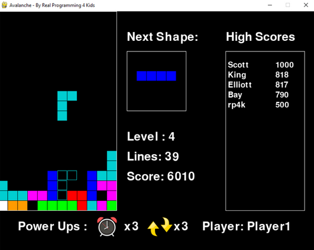

# Avalanche

Students will be challenged to create their own version of the game **Avalanche** over the course of 18 weeks or in a summer camp. **Avalanche** is our version of the classic **Tetris** game which involves moving/rotating shapes to complete a line. 
The more lines you complete, the better the score will be and the faster the game will get! 
Compete on a highscore board that saves the top 10 with file read/write commands. 
While the game is simple in concept the mathematics involved require some clever thought.

The tools of the course involve the industry used **PyCharm** program from JetBrains using the **Python** programming language.

# Learning Goals

The outcome is to develop a student’s love for programming while instilling within them introductory mathematical skills, computer experience and critical thinking which can be taken outside of a class environment.

We at RP4K wish to encourage students who have an interest in coding, math or general curiosity at how things work to explore programming through game development.

Below is a detailed list of what a student will learn throughout our Avalanche course.

## General Code Skill

## Objected Oriented Programming

## Math

# Course Outline
The course is broken into 10 main lessons, each with a specific objective in mind.
These lessons take 1-2 weeks to complete depending on pacing.

| Lesson | Topic                       | Suggested Homework                                   |
|------|-----------------------------------|------------------------------------------------------|
| 1    | Install, Setup and Window Creation          |                                                      |
| 2    | The Blocks                                  |                                                      |
| 3    | The Game Board and Shapes                   |                                                      |
| 4    | Rotating the Shape using Trigonometry       |                                                      |
| 5    | Falling Shapes and Getting a New Shape      |                                                      |
| 6    | Game Over and Completing a Line             |                                                      |
| 7    | Keeping Score, Levels, Next Shape and Sounds|                                                      |
| 8    | Power Ups and Title Screen                  |                                                      |
| 9    | High Scores                                 |                                                      |
| 10   | Customization                               |                                                      |

# Instructional Method
Students participate in Live Virtual Sessions through a video program called Zoom.
These sessions are the primary form of learning, where an instructor guides the student
through the course material. Our class sizes are limited to a maximum of 4 students per
instructor and take place between 1-2 hours once per week at a scheduled time and
Day.

Students also have access to our online resources through RP4K’s Canvas Portal.
Extra material in the form of quizzes, discussions, assignments, and other materials are
provided for additional learning outside of the Live Virtual Sessions. Previous course
recordings are uploaded and students can participate in class discussions or contact the
instructor with any questions they may have.

# Additional Notes:
**Installation needs to happen before the course starts.**
**It is highly recommended to have Canvas access to this course in advance as it contains more specialized instructions on how to setup Unity and the project among other beneficial learning content.**
Please ensure that the student has the template installed and to keep GitHub desktop installed in case students would like to work in groups. 
Follow the installation guide below to get started and reach out if you have any questions at [our email info@realprogramming.com](mailto:info@realprogramming.com)!

# Links
[Python Installation Instructions (please reach out if you are unable to access link)](https://realprogramming.instructure.com/courses/1061/pages/python-installation?module_item_id=98421)

[PyCharm Installation Instructions (please reach out if you are unable to access link)](https://realprogramming.instructure.com/courses/1061/pages/pycharm-installation?module_item_id=98423)

[PyCharm Tutorial (please reach out if you are unable to access link)](https://realprogramming.instructure.com/courses/1061/pages/pycharm-tutorial?module_item_id=98424)

[Website](https://realprogramming.com/)
